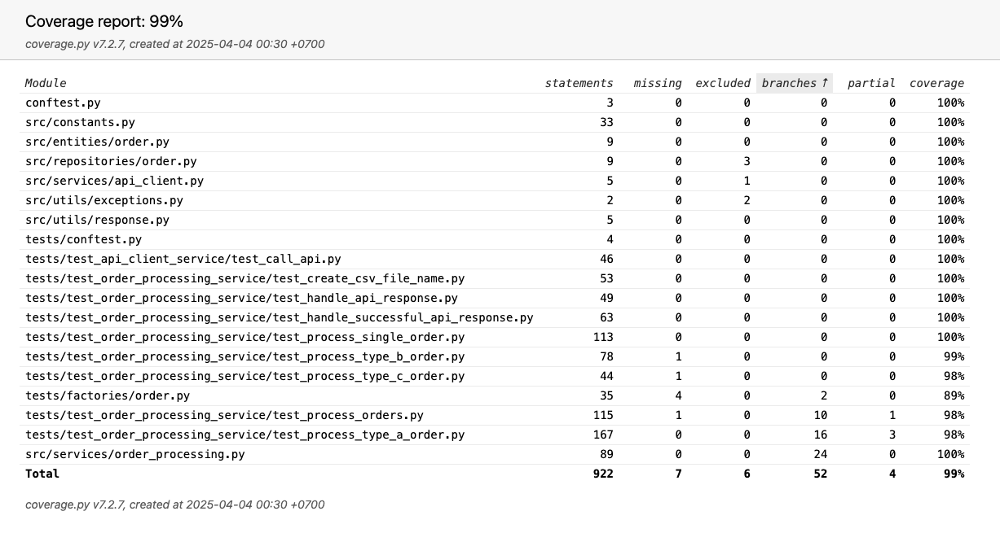

# Python Unit Test Project


## Running Unit Tests

### Prerequisites
- Python 3.x
- pip (Python package installer)

### Installation
1. Clone the repository
2. Install dependencies:
```bash
pip install -r requirements.txt
```

### Running Tests
#### Generate Detailed Coverage Reports
```bash
pytest --cov --cov-report=html:coverage_report --cov-report=xml:coverage_report/coverage.xml --cov-report=lcov:coverage_report/lcov.info
```

This command will generate:
- HTML report: coverage_report/index.html
- XML report: coverage_report/coverage.xml
- LCOV report: coverage_report/lcov.info

#### Run Specific Test File
```bash
pytest tests/test_order_processing_service/test_process_orders.py
```

### Test Configuration
The project uses a `.coveragerc` file to configure coverage reporting:
- Excludes certain files from coverage (site-packages, __init__.py)
- Excludes specific lines from coverage reports
- Configures coverage thresholds

## Coverage Report



### Overall Coverage
| Metric | Value |
|--------|-------|
| Total Coverage | 99% |
| Source Code Coverage | 100% |
| Test Code Coverage | 99% |

### Coverage Details
| Metric | Value |
|--------|-------|
| Total Statements | 922 |
| Missed Statements | 7 |
| Total Branches | 52 |
| Missed Branches | 3 |

### Files with 100% Coverage
| File | Coverage |
|------|----------|
| src/constants.py | 100% |
| src/entities/order.py | 100% |
| src/repositories/order.py | 100% |
| src/services/api_client.py | 100% |
| src/services/order_processing.py | 100% |
| src/utils/exceptions.py | 100% |
| src/utils/response.py | 100% |

### Files with Partial Coverage
| File | Coverage | Missing Items |
|------|----------|---------------|
| tests/factories/order.py | 89% | Lines: 93, 110, 127, 144 |
| tests/test_order_processing_service/test_process_orders.py | 98% | Line: 131 |
| tests/test_order_processing_service/test_process_type_a_order.py | 98% | Branches: 56->exit, 159->exit, 235->exit |
| tests/test_order_processing_service/test_process_type_b_order.py | 99% | Line: 13 |
| tests/test_order_processing_service/test_process_type_c_order.py | 98% | Line: 12 |
